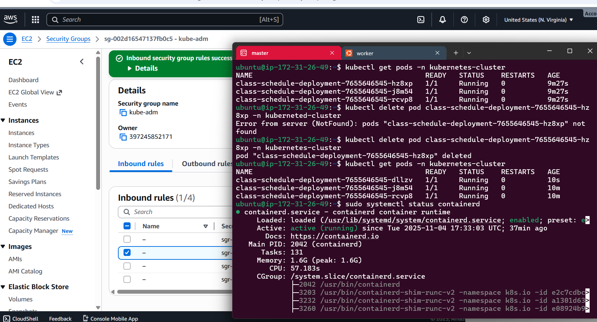

````markdown
# Kubernetes Cluster Setup using Kubeadm

This guide explains how to set up a Kubernetes cluster using **kubeadm** on AWS EC2 Ubuntu instances.

🎥 **Video :** https://youtu.be/Pud7IYbnaCE  
🖼️ **Cluster Success Screenshot:**  


---

## ✅ Prerequisites

| Requirement | Details |
|------------|---------|
| OS         | Ubuntu 20.04 or later |
| Instance Type | `t2.medium` or higher |
| Nodes Needed | 1 Master + 1 or more Worker nodes |

---

## 🌐 AWS Security Group Setup

1. Place all nodes in the **same Security Group**.
2. Allow the following ports:
   | Port | Purpose |
   |------|---------|
   | `6443` | API Server (Workers connect to Master) |
   | `22`   | SSH Access |

---

## ⚙️ Execute on **BOTH Master & Worker Nodes**

### 1. Disable Swap
```bash
sudo swapoff -a
````

### 2. Load Kernel Modules

```bash
cat <<EOF | sudo tee /etc/modules-load.d/k8s.conf
overlay
br_netfilter
EOF

sudo modprobe overlay
sudo modprobe br_netfilter
```

### 3. Apply Sysctl Networking Settings

```bash
cat <<EOF | sudo tee /etc/sysctl.d/k8s.conf
net.bridge.bridge-nf-call-iptables  = 1
net.bridge.bridge-nf-call-ip6tables = 1
net.ipv4.ip_forward                 = 1
EOF

sudo sysctl --system
```

### 4. Install & Configure Containerd

```bash
sudo apt-get update
sudo apt-get install -y ca-certificates curl
sudo install -m 0755 -d /etc/apt/keyrings
sudo curl -fsSL https://download.docker.com/linux/ubuntu/gpg -o /etc/apt/keyrings/docker.asc
sudo chmod a+r /etc/apt/keyrings/docker.asc

echo "deb [arch=$(dpkg --print-architecture) signed-by=/etc/apt/keyrings/docker.asc] https://download.docker.com/linux/ubuntu $(. /etc/os-release && echo \"$VERSION_CODENAME\") stable" | sudo tee /etc/apt/sources.list.d/docker.list > /dev/null

sudo apt-get update
sudo apt-get install -y containerd.io

containerd config default | sed -e 's/SystemdCgroup = false/SystemdCgroup = true/' -e 's/sandbox_image = "registry.k8s.io\/pause:3.6"/sandbox_image = "registry.k8s.io\/pause:3.9"/' | sudo tee /etc/containerd/config.toml

sudo systemctl restart containerd
```

### 5. Install Kubernetes Components

```bash
sudo apt-get update
sudo apt-get install -y apt-transport-https ca-certificates curl gpg

curl -fsSL https://pkgs.k8s.io/core:/stable:/v1.29/deb/Release.key | sudo gpg --dearmor -o /etc/apt/keyrings/kubernetes-apt-keyring.gpg
echo 'deb [signed-by=/etc/apt/keyrings/kubernetes-apt-keyring.gpg] https://pkgs.k8s.io/core:/stable:/v1.29/deb/ /' | sudo tee /etc/apt/sources.list.d/kubernetes.list

sudo apt-get update
sudo apt-get install -y kubelet kubeadm kubectl
sudo apt-mark hold kubelet kubeadm kubectl
```

---

## 🖥️ Execute on **Master Node Only**

### 1. Initialize Kubernetes Cluster

```bash
sudo kubeadm init --pod-network-cidr=192.168.0.0/16
```

### 2. Configure Local kubeconfig

```bash
mkdir -p $HOME/.kube
sudo cp -i /etc/kubernetes/admin.conf $HOME/.kube/config
sudo chown $(id -u):$(id -g) $HOME/.kube/config
```

### 3. Install Calico Network Plugin

```bash
kubectl apply -f https://raw.githubusercontent.com/projectcalico/calico/v3.27.0/manifests/calico.yaml --validate=false
```

### 4. Generate Worker Join Command

```bash
kubeadm token create --print-join-command
```

---

## 🧩 Execute on **Worker Nodes**

Run the join command received from the master and append containerd socket:

```bash
sudo <kubeadm join command here> --cri-socket "unix:///run/containerd/containerd.sock" --v=5
```

---

## ✅ Verify Cluster Status (on Master)

```bash
kubectl get nodes
```

---

## 🎉 Success Screenshot


---

## 🎊 Done!

Your Kubernetes cluster is now **up and running** ✅
Happy Clustering! 🚀

```

